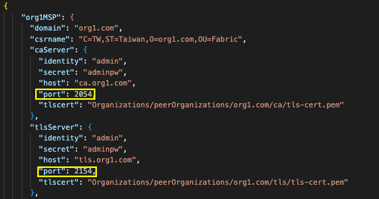

# Hyperledger Fabric 實作

## 環境準備

### Windows 11/10

1. 安裝 Ubuntu 於 VMWare 環境
2. 安裝 Ubuntu 於 VirtualBox
3. 使用 WSL2
   1. 安裝 docker-desktop
4. 安裝VSCode

### Mac OSX

1. 安裝 docker-desktop
2. 安裝 vscode

### Ubuntu

1. 安裝 vscode

## 下載課程材料

### 使用 vscode 連線到工具環境

1. remote ssh
2. WSL2
3. 開啟本端資料夾

### 下載

```bash
mkdir $HOME/workspaces
cd $HOME/workspaces
git clone --recursive https://gitlab.com/cshuangtw/fabric-lab.git
```

### 安裝套件

```bash
cd $HOME/workspaces/fabric-lab
./env-deploy.sh
```

### 重新開機

> 套用所有變更， 請先重新開機

### 測試安裝結果

```bash
cd $HOME/workspaces/fabric-lab/fabric-samples/test-network
./network.sh up createChannel -c channel1 -s couchdb -ca
```

```docker
docker ps
CONTAINER ID   IMAGE                               COMMAND                   CREATED          STATUS          PORTS                                                                                                NAMES
0ff4a2623c87   hyperledger/fabric-tools:latest     "/bin/bash"               19 seconds ago   Up 18 seconds                                                                                                        cli
e7bea861e60c   hyperledger/fabric-peer:latest      "peer node start"         20 seconds ago   Up 19 seconds   0.0.0.0:7051->7051/tcp, :::7051->7051/tcp, 0.0.0.0:9444->9444/tcp, :::9444->9444/tcp                 peer0.org1.example.com
d68acf0d5f43   hyperledger/fabric-peer:latest      "peer node start"         20 seconds ago   Up 19 seconds   0.0.0.0:9051->9051/tcp, :::9051->9051/tcp, 7051/tcp, 0.0.0.0:9445->9445/tcp, :::9445->9445/tcp       peer0.org2.example.com
50cbfab22d0a   couchdb:3.1.1                       "tini -- /docker-ent…"   21 seconds ago   Up 19 seconds   4369/tcp, 9100/tcp, 0.0.0.0:7984->5984/tcp, :::7984->5984/tcp                                        couchdb1
353cf7a40249   hyperledger/fabric-orderer:latest   "orderer"                 21 seconds ago   Up 19 seconds   0.0.0.0:7050->7050/tcp, :::7050->7050/tcp, 0.0.0.0:9443->9443/tcp, :::9443->9443/tcp                 orderer.example.com
f64ee0982d6d   couchdb:3.1.1                       "tini -- /docker-ent…"   21 seconds ago   Up 19 seconds   4369/tcp, 9100/tcp, 0.0.0.0:5984->5984/tcp, :::5984->5984/tcp                                        couchdb0
43dbfc1f7a60   hyperledger/fabric-ca:latest        "sh -c 'fabric-ca-se…"   25 seconds ago   Up 23 seconds   0.0.0.0:8054->8054/tcp, :::8054->8054/tcp, 7054/tcp, 0.0.0.0:18054->18054/tcp, :::18054->18054/tcp   ca_org2
67def3a16305   hyperledger/fabric-ca:latest        "sh -c 'fabric-ca-se…"   25 seconds ago   Up 23 seconds   0.0.0.0:7054->7054/tcp, :::7054->7054/tcp, 0.0.0.0:17054->17054/tcp, :::17054->17054/tcp             ca_org1
6eebb1476ed3   hyperledger/fabric-ca:latest        "sh -c 'fabric-ca-se…"   25 seconds ago   Up 23 seconds   0.0.0.0:9054->9054/tcp, :::9054->9054/tcp, 7054/tcp, 0.0.0.0:19054->19054/tcp, :::19054->19054/tcp   ca_orderer
```

### 停止 shudown network

```
./network.sh down
```

## Fabric-CA

### Fabric-ca server 啟動

> **工作目錄: $HOME/workspaces/fabric-lab/ca**
>
> ```bassh
> docker-compose up -d
> ```

### Fabric-ca client

> **工作目錄: $HOME/workspaces/fabric-lab/workdir/ca**
>
> 1. 複製目錄 msp-template 到 msp
> 2. 將 orderer.json 更名 *org4.json*
> 3. 將 peer.json 更名 *org1.json*
> 4. 將 msp-template/peer.json 複製到 msp 目錄並更名為 *org2.json*
> 5. 將 msp-template/peer.json 複製到 msp 目錄並更名為 *org3.json*
> 6. 依序修改檔案
>
>    *org1.json
>
>    2054 -> 1054
>
>    2154 -> 1154
>
>    caServer.secret  修改 和 $HOME/workspaces/fabric-lab/ca/config/org1.com/ca/fabric-ca-server-config.yaml 的 pass: 相同
>
>    tlsServer.secret  修改 和 $HOME/workspaces/fabric-lab/ca/config/org1.com/tls/fabric-ca-server-config.yaml 的 pass: 相同
>
>    
>
>    *org2.json*
>
>    org1.com -> org2.com
>
>    caServer.secret  修改 和 $HOME/workspaces/fabric-lab/ca/config/org2.com/ca/fabric-ca-server-config.yaml 的 pass: 相同
>
>    tlsServer.secret  修改 和 $HOME/workspaces/fabric-lab/ca/config/org2.com/tls/fabric-ca-server-config.yaml 的 pass: 相同
>
>    *org3.com*
>
>    org1.com -> org3.com
>
>    2054 -> 3054
>
>    2154 -> 3154
>
>    caServer.secret  修改 和 $HOME/workspaces/fabric-lab/ca/config/org3.com/ca/fabric-ca-server-config.yaml 的 pass: 相同
>
>    tlsServer.secret  修改 和 $HOME/workspaces/fabric-lab/ca/config/org3.com/tls/fabric-ca-server-config.yaml 的 pass: 相同
>
>    org4.com
>
>    caServer.secret  修改 和 $HOME/workspaces/fabric-lab/ca/config/org4.com/ca/fabric-ca-server-config.yaml 的 pass: 相同
>
>    tlsServer.secret  修改 和 $HOME/workspaces/fabric-lab/ca/config/org4.com/tls/fabric-ca-server-config.yaml 的 pass: 相同
>
> ***PS:***

> ```bash
>  find ../../../ca/config/*/*/fabric-ca-server-config.yaml|xargs grep pass:
> ```

### 執行 ../scripts/networkgen.sh 生成  network.json

```bash
../scripts/networkgen.sh -t organizations.json -o org4.json -p org1.json -p org2.json -p org3.json -O ../network.json
```

### 生成加密文件

> **工作目錄: $HOME/workspaces/fabric-lab/workdir/ca**
>
> *註冊 fabric-ca server 的 admin 帳號*
>
> ```bash
> ./scripts/enroll.sh ./network.json 
> ```
>
> *registry & enroll 所有的檵構，參與個體的加密材料*
>
> ```bash
> ./scripts/crypto.sh ./network.json
> ```

## 創世塊 (Genesis Block)

> **工作目錄: $HOME/workspaces/fabric-lab/workdir/config**
>
> 1. 將 $HOME/workspaces/fabric-lab/workdir/ca/channelMSP 複製到 $HOME/workspaces/fabric-lab/workdir/config/organizations
>    ```bash
>    cp -a $HOME/workspaces/fabric-lab/workdir/ca/channelMSP $HOME/workspaces/fabric-lab/workdir/config/organizations
>    ```
> 2. 執行scripts 生成 system channel genesis block, 以及  channel1, channel2. channel3 的 config block (channel `N`.tx)

## Orderer Service

> **工作目錄: $HOME/workspaces/fabric-lab/service/orderer**
>
> 1. 複製 $HOME/workdir/fabric-lab/workdir/ca/localMSP/ordererOrganizations/org4.com/orderers/orderer`N`.org4.com 到 $HOME/workspaces/fabric-lab/service/orderer/org4.com/orderer `N`.org4.com/orderer `N`.org4.com
>
> ```bash
> cd $HOME/workspaces/fabric-lab/service/orderer
> ./scripts/cpMSP.sh
> ```
>
> 2. **啟動 orderer service (3 orderer nodes)**
>
> ```bash
>  ./docker-compose up -d
> ```

## Peer Service

> **工作目錄: $HOME/workspaces/fabric-lab/service/peer**
>
> 1. 執行script 將 $HOME/workspaces/fabric-lab/workdir/ca/localMSP/peerOrganizations/org`x`.com/peer`y.`org`x`.com/ 複製到 $HOME/workspaces/fabric-lab/service/peers/org`x`.com/peer`y`.org`x`.com/peer`y`.org`x`.com/ 目錄
>
> ```bash
> cd $HOME/workspaces/fabric-lab/service/peers
> ./scripts/cpMSP.sh
> ```

2. 啟動 peer service (with couchdb)
> ```bash
> docker-compose up -d
> ```

## Create channel & join channel

**工作目錄: $HOME/workspaces/fabric-lab/workdir/org1-client**
1. 啟始環境
   1. 複製相關檔案
      1. 管理者的加密材料檔案 (MSP, TLS)
      2. 每一參與機構的 TLS Root CA, 
   ```bash
   ./scripts/init.sh
   ```
   2. 設定環境變數
   ```bash
   source ./peer.env peer0 1051
   ```
2. Create channel1 
   ```bash
   cd tmp
   peer channel create -f ../../channel-artifacts/channel1.tx -c channel1 -o orderer0.org4.com:4050 --tls --cafile $ORDERER_TLS_CA
   ```
3. join channel1
   ```bash
   ls
   ```
   > ```sh
   > channel1.block
   > ```
   >
   > ```bash
   > peer channel join -b channel1.block
   > ```

4. org2 join channel1
   
   **工作目錄: $HOME/workspaces/fabric-lab/workdir/org2-client**
      1. 複製相關檔案
      2. 管理者的加密材料檔案 (MSP, TLS)
      3. 每一參與機構的 TLS Root CA, 
   ```bash
   ./scripts/init.sh
   ```
   1. 設定環境變數
   ```bash
   source ./peer.env peer0 2051
   ```
   2. Fetch channel1 的 **`config block`** 
   ```bash
   cd tmp
   peer channel fetch config -c channel1 -o orderer0.org4.com:4050 --tls --cafile $ORDERER_TLS_CA
   ```
   3. 使用 config_block join channel 
   ```bash
   ls 
   ```
   ```bash
   channel1_config.block
   ```
   ```bash
   peer channel join -b channel1_config.block 
   ```
   > ```log
   > 2023-11-03 18:09:42.322 CST [channelCmd] InitCmdFactory -> INFO 001 Endorser and orderer connections initialized
   > 2023-11-03 18:09:42.483 CST [channelCmd] executeJoin -> INFO 002 Successfully submitted proposal to join channel
   > ```
   4. 檢查 channel 列表
   ```bash
   peer channel list
   ```
   > ```
   > 2023-11-03 18:10:48.678 CST [channelCmd] InitCmdFactory -> INFO 001 Endorser > and orderer connections initialized
   > Channels peers has joined: 
   > channel1
   > ```
### 設定 anchor peer
**工作目錄: $HOME/workspaces/fabric-lab/workdir/org1-client/**

1. 設定 org1.com 的環境變數
   ```bash
   cd $HOME/workspaces/fabric-lab/workdir/org1-client/
   source peer.env peer0 1051
   cd tmp/
   ../scripts/setAnchorPeer.sh channel1
   ```
   > ```bash
   > 2023-11-03 18:26:07.174 CST [channelCmd] InitCmdFactory -> INFO 001 Endorser and orderer connections initialized
   > 2023-11-03 18:26:07.176 CST [cli.common] readBlock -> INFO 002 Received block: 1
   > 2023-11-03 18:26:07.176 CST [channelCmd] fetch -> INFO 003 Retrieving last config block: 1
   > 2023-11-03 18:26:07.177 CST [cli.common] readBlock -> INFO 004 Received block: 1
   > 2023-11-03 18:26:07.268 CST [channelCmd] InitCmdFactory -> INFO 001 Endorser and orderer connections initialized
   > 2023-11-03 18:26:07.274 CST [channelCmd] update -> INFO 002 Successfully submitted channel update
   > ```

### Deploy chaincode

#### Deploy on org1

   **工作目錄: $HOME/workspaces/fabric-lab/workdir/org1-client/**
   1. 設定環境變數
      ```bash
      cd $HOME/workspaces/fabric-lab/workdir/org1-client/
      source peer.env peer0 1051
      ```
   2. package chaincode
      ```bash
      peer lifecycle chaincode package basid.tar.gz --path ../../chaincode/asset-transfer-basic/chaincode-go/ --lang golang --label basic_1.0
      ```
   3. install chaincode
      ```bash
      peer lifecycle chaincode install basid.tar.gz
      ```
      > ```log
      > 2023-11-03 20:36:38.648 CST [cli.lifecycle.chaincode] submitInstallProposal -> INFO 001 Installed remotely: response:<status:200 payload:"\nJbasic_1.0:ab5445336ed6be64b8e567ed267c88631da6bfafefd805187e4919abc8bc7376\022\tbasic_1.0" > 
      > 2023-11-03 20:36:38.648 CST [cli.lifecycle.chaincode] submitInstallProposal -> INFO 002 Chaincode code package identifier: basic_1.0:ab5445336ed6be64b8e567ed267c88631da6bfafefd805187e4919abc8bc7376
      export CC_PACKAGE_ID=basic_1.0:ab5445336ed6be64b8e567ed267c88631da6bfafefd805187e4919abc8bc7376
      > ```
   4. approve chaincode
      ```bash
      peer lifecycle chaincode approveformyorg -C channel1 -n basic --version 1.0 --sequence 1 -o orderer1.org4.com:4150 --tls --cafile $ORDERER_TLS_CA --package-id $CC_PACKAGE_ID
      ```
      > ```bash  
      > 2023-11-03 20:45:29.937 CST [chaincodeCmd] ClientWait -> INFO 001 txid[eae5a6d4199f7573eb4cccfce08bd1c57df79397d39eaad040f9843d4c4e1ab3] committed with status (VALID) at peer0.org1.com:1051
      ```
   5. chech commit readiness
      ```bash
       peer lifecycle chaincode checkcommitreadiness -C channel1 --name basic --version 1.0 --sequence 1 
      ```
      > ```bash
      >Chaincode definition for chaincode 'basic', version '1.0', sequence '1' on channel 'channel1' approval status by org:
      > Org1MSP: true
      > Org2MSP: false
      > ```

#### deploy on org2

   **工作目錄: $HOME/workspaces/fabric-lab/workdir/org2-client/**

   1. 設定環境變數
      ```bash
      cd $HOME/workspaces/fabric-lab/workdir/org2-client/
      source peer.env peer0 2051
      ```
   2. package chaincode
      ```bash
      peer lifecycle chaincode package basid.tar.gz --path ../../chaincode/asset-transfer-basic/chaincode-go/ --lang golang --label basic_1.0
      ```
   3. install chaincode
      ```bash
      peer lifecycle chaincode install basid.tar.gz
      ```
      > ```log
      > 2023-11-03 20:36:38.648 CST [cli.lifecycle.chaincode] submitInstallProposal -> INFO 001 Installed remotely: response:<status:200 payload:"\nJbasic_1.0:ab5445336ed6be64b8e567ed267c88631da6bfafefd805187e4919abc8bc7376\022\tbasic_1.0" > 
      > 2023-11-03 20:36:38.648 CST [cli.lifecycle.chaincode] submitInstallProposal -> INFO 002 Chaincode code package identifier: basic_1.0:ab5445336ed6be64b8e567ed267c88631da6bfafefd805187e4919abc8bc7376
      export CC_PACKAGE_ID=basic_1.0:ab5445336ed6be64b8e567ed267c88631da6bfafefd805187e4919abc8bc7376
      > ```
   4. approve chaincode
      ```bash
      peer lifecycle chaincode approveformyorg -C channel1 -n basic --version 1.0 --sequence 1 -o orderer1.org4.com:4150 --tls --cafile $ORDERER_TLS_CA --package-id $CC_PACKAGE_ID
      ```
      > ```bash  
      > 2023-11-03 20:45:29.937 CST [chaincodeCmd] ClientWait -> INFO 001 txid[eae5a6d4199f7573eb4cccfce08bd1c57df79397d39eaad040f9843d4c4e1ab3] committed with status (VALID) at peer0.org2.com:1051
      ```
   5. chech commit readiness
      ```bash
       peer lifecycle chaincode checkcommitreadiness -C channel1 --name basic --version 1.0 --sequence 1 -o orderer1.org4.com:4150 --tls --cafile $ORDERER_TLS_CA
      ```
      > ```bash
      >Chaincode definition for chaincode 'basic', version '1.0', sequence '1' on channel 'channel1' approval status by org:
      > org2MSP: true
      > Org2MSP: false
      > ```
   6. commit chaincode
      ```bash
      peer lifecycle chaincode commit -C channel1 --name basic --version 1.0 --sequence 1 -o orderer1.org4.com:4150 --tls --cafile $ORDERER_TLS_CA --peerAddresses peer0.org1.com:1051 --tlsRootCertFiles $PWD/../tlsca/tlsca.org1.com-cert.pem --peerAddresses peer0.org2.com:2051 --tlsRootCertFiles $PWD/../tlsca/tlsca.org2.com-cert.pem
      ```
      > ```bash
      > 2023-11-03 21:13:30.644 CST [chaincodeCmd] ClientWait -> INFO 001 txid [02402f0e4419aa226375a210a91b659a1154835224cada7f3c62ac13e1ef6036] committed with status (VALID) at peer0.org1.com:1051
      > 2023-11-03 21:13:30.646 CST [chaincodeCmd] ClientWait -> INFO 002 txid [02402f0e4419aa226375a210a91b659a1154835224cada7f3c62ac13e1ef6036] committed with status (VALID) at peer0.org2.com:2051
      > ```
